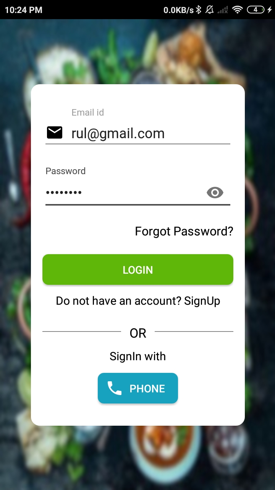
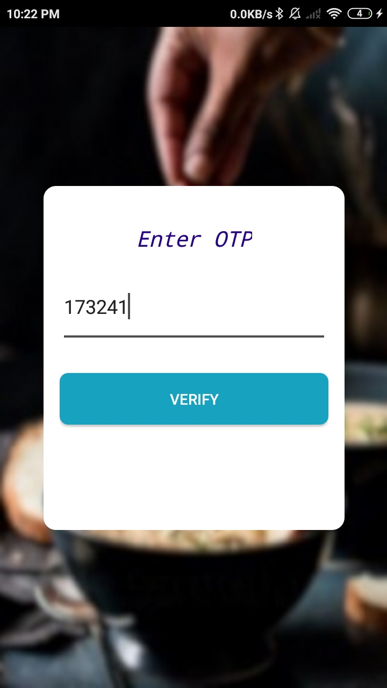
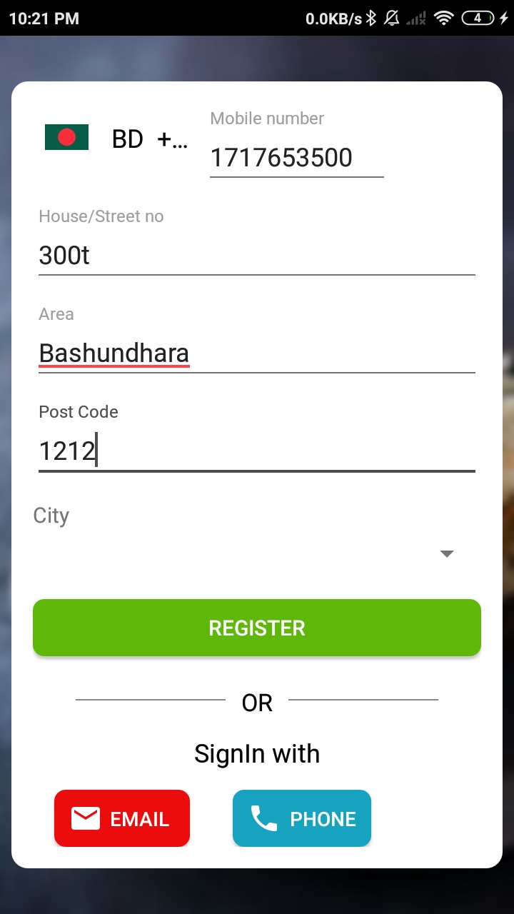
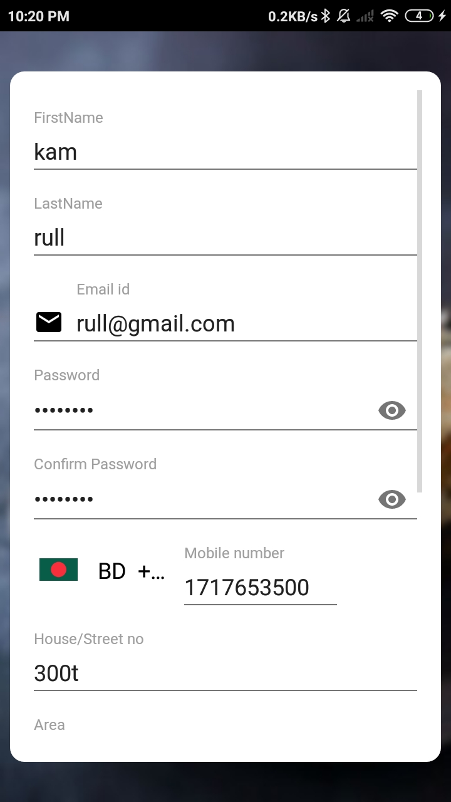
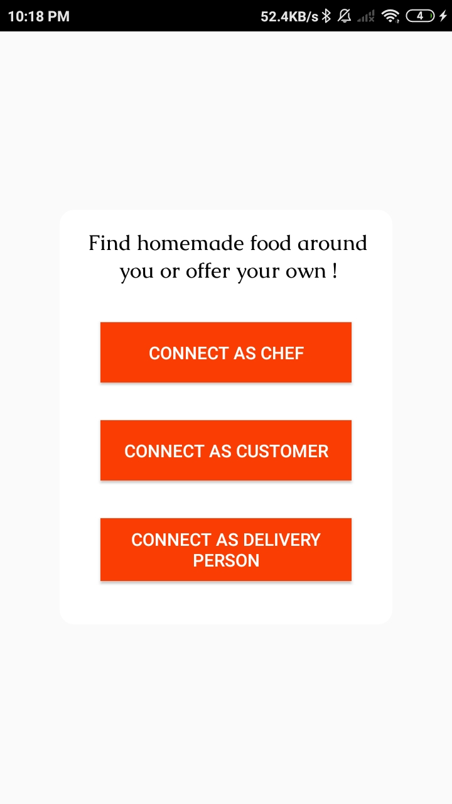
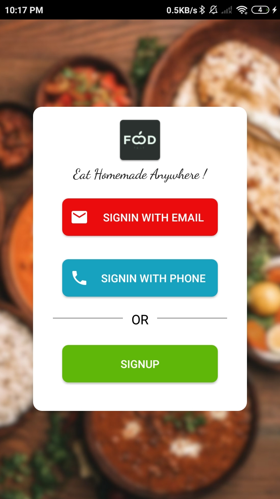

# FoodFest

## Introduction
---
Got sick of fast-food or regular restaurants food or you lost appetite? 

Eat what you like, where you like, when you like. Find the local tastes you're looking for, all by clicking a button. Browse local homemade food provider. Or get just what you’re looking for by searching for a specific mouthwatering dish or cuisine. For the love of homemade foods, try FoodFest. 

With Bkash make payments more easily and Keep track of your order in real-time as it goes your way. 

## Features
---

## Data management
---
To Store data I used `Firebase` database. 

## Design Pattern
---

### Android
 `Fragment`, `Authentication`. Use `adapter` pattern to  load `recyclerview` data. 

### Server
Application backend server is built with `Nodejs` and `express`. Server side is developed using `MVC` Design Pattern. 

## Roadblocks
---
*Responsive UI* : While porting the UI from Figma has a huge downside. Figma's generated Android code is not enough to implement in real application. Exporting `drawble` doesn't solve the porblem. I had to write boiler plate `XML` code for each drawbles. To reduce the number of drawable, I use built in drawbles such as `checkbox`, `selector` etc. 

*Android Emulator* : Android Device emulator is obselute for development.. After a certain period of time, Emulator shows a dialog box `System UI`and stop working. 
